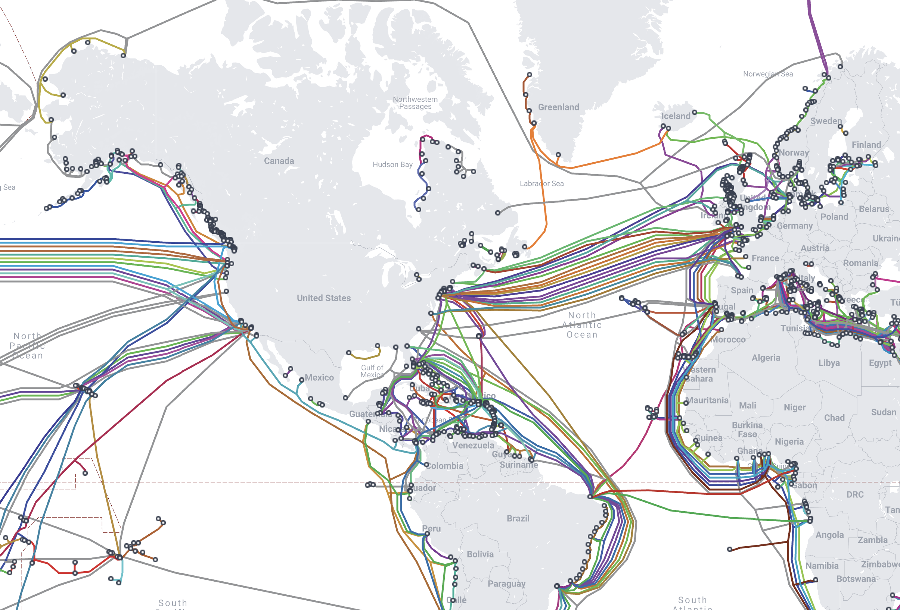

# `Day 41 - Intermediate+`

# How Does the Internet Work?

The internet is a vast network of networks that connects computers across the globe, enabling them to communicate and share information. It operates through a combination of technologies, protocols, and physical infrastructure, including underwater cables, satellites, and Wi-Fi signals.

## Key Components

### Underwater Cables

One of the most fascinating aspects of the internet's infrastructure is the network of underwater cables that crisscross the oceans. These cables, spanning thousands of kilometers, carry vast amounts of data between continents at the speed of light. They are laid deep beneath the ocean surface, where they are protected from most threats but remain vulnerable to damage from earthquakes, fishing nets, and even shark bites.

### Data Centers

Data centers are large facilities housing tens of thousands of servers. These servers store websites, videos, emails, and other data, making it accessible to users around the world. When you access a website or stream a video, you're likely retrieving data from one of these centers.

### Internet Service Providers (ISPs)

ISPs are companies that provide internet access to homes, businesses, and mobile devices. They connect to the larger internet infrastructure through high-capacity connections, often using fiber-optic cables, and then distribute access to their customers.

### Protocols

Protocols are sets of rules that govern how data is transmitted over the internet. The most fundamental protocols are TCP/IP (Transmission Control Protocol/Internet Protocol), which define how computers send packets of data to each other.

## How It All Works Together

When you type a URL into your web browser, several things happen behind the scenes:

1. **Domain Name System (DNS) Lookup**: Your computer uses DNS to translate the URL into an IP address, which identifies the server hosting the website.

2. **Establishing a Connection**: Using TCP/IP, your computer establishes a connection to the server, requesting the webpage.

3. **Data Transfer**: The server responds by sending the requested webpage data back to your computer in packets.

4. **Rendering the Webpage**: Your web browser receives the data packets, reassembles them into a complete webpage, and displays it to you.

## Exciting Stuff

The internet's infrastructure is not just functional; it's also fascinating. Here are some exciting facts:

- **Global Connectivity**: Underwater cables make up about 95% of global internet traffic, connecting continents and enabling real-time communication worldwide.
  
- **Resilience**: Despite being vulnerable to damage, the network of underwater cables is remarkably resilient. Multiple paths between continents mean that data can often be rerouted around broken cables.

- **Future Technologies**: As demand for internet access grows, new technologies like satellite internet aim to complement existing infrastructure, offering high-speed internet access to remote areas.

## Further Exploration

For those intrigued by the complexities and the physical reality of the internet's infrastructure, there are several resources available that offer deeper insights:

### Submarine Cable Map

[Submarine Cable Map](https://www.submarinecablemap.com/) is an interactive online tool that visualizes the global network of submarine cables. This map provides a unique perspective on the physical infrastructure that underpins the internet, allowing users to explore the routes of underwater cables, learn about their capacities, and understand their importance in global connectivity. It's a fascinating resource for anyone interested in the tangible aspects of the internet's architecture.

### Documentaries and Articles

There are numerous documentaries and articles available online that delve into the history, construction, and maintenance of underwater cables, as well as the broader implications of internet infrastructure on society and global communication. Exploring these resources can provide a deeper understanding of the challenges and innovations in keeping the world connected.

## Conclusion

Understanding how the internet works helps us appreciate the incredible feat of engineering and cooperation that enables our connected world. From the depths of the oceans to the edge of space, the internet truly spans the globe. Resources like the Submarine Cable Map offer a glimpse into the physical reality of this vast network, highlighting the importance of infrastructure in our daily lives and the future of global connectivity.
