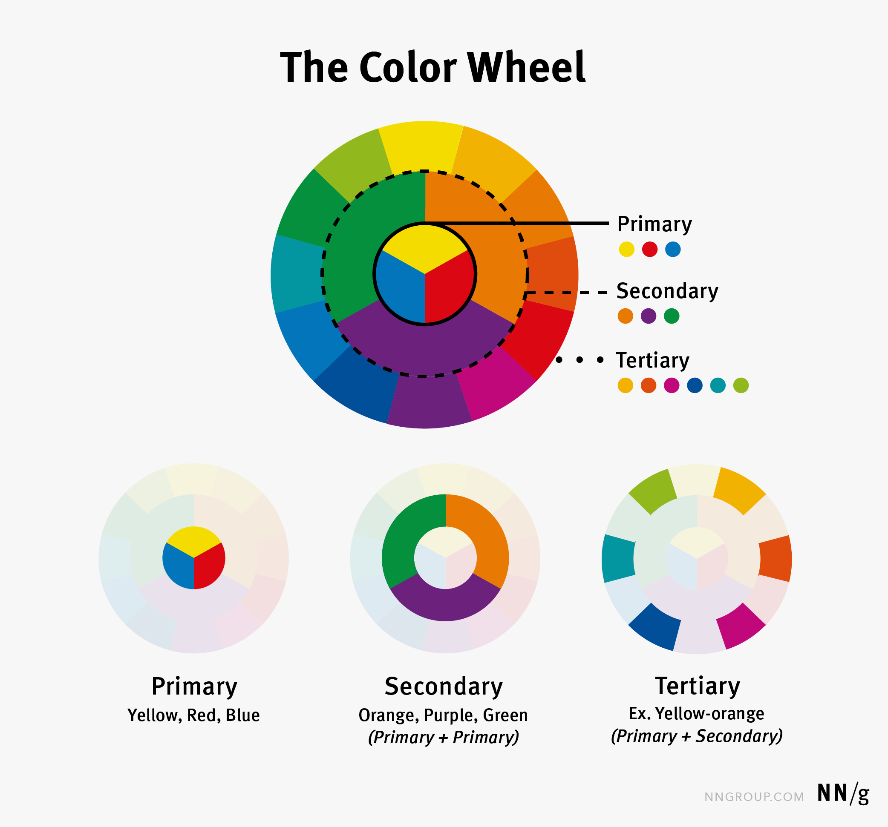

# `Day 65 - Advanced`

# Color Theory in Design

Color theory is a fundamental aspect of graphic design, influencing the aesthetic appeal and effectiveness of visual communication. Understanding color theory enables designers to create visually appealing designs that communicate messages effectively. This guide introduces the basics of color theory and its application in design.

## Introduction to Color Theory

Color theory is the study of how colors interact with each other and how those interactions affect human perception. It encompasses concepts such as hue, saturation, brightness, and contrast, which are crucial for creating balanced and harmonious color schemes.

## Importance of Color in Design

- **Communication:** Colors can evoke emotions and convey messages, influencing the audience's perception of a brand or product.
- **Brand Identity:** Consistent use of color helps establish and reinforce a brand's identity.
- **User Experience:** Effective use of color enhances usability and accessibility, guiding users through interfaces.

## Principles of Color Theory

### Hue

Hue refers to the type of color (e.g., red, blue, yellow). Combining hues creates vibrant and interesting color schemes.

### Saturation

Saturation describes the intensity of a color. High saturation makes colors more vivid, while low saturation tones them down.

### Brightness

Brightness indicates how light or dark a color is. Bright colors stand out, while darker colors recede.

### Contrast

Contrast between colors makes elements distinct and improves readability. High contrast is essential for accessibility.

## Practical Tips for Designers

- **Choose a Color Scheme:** Start with a primary color and choose complementary, analogous, or monochromatic colors based on your design needs.
- **Consider Accessibility:** Ensure there's enough contrast between text and background colors for readability.
- **Test Colors:** Use tools like color wheels and online color testers to experiment with different combinations.
- **Stay Consistent:** Maintain consistency in your color choices across all design materials to strengthen your brand identity.

## Tools for Working with Color

Several tools and resources can assist designers in working with color theory:

- **Color Wheels:** Visualize relationships between colors.
- **Palette Generators:** Create harmonious color schemes automatically.
- **Hex Codes:** Standardized codes representing colors in digital design.

## Conclusion

Understanding and applying color theory is essential for designers looking to create impactful and effective visual communications. By mastering the principles of color theory, designers can enhance their work, making it more engaging, accessible, and aligned with their goals.

