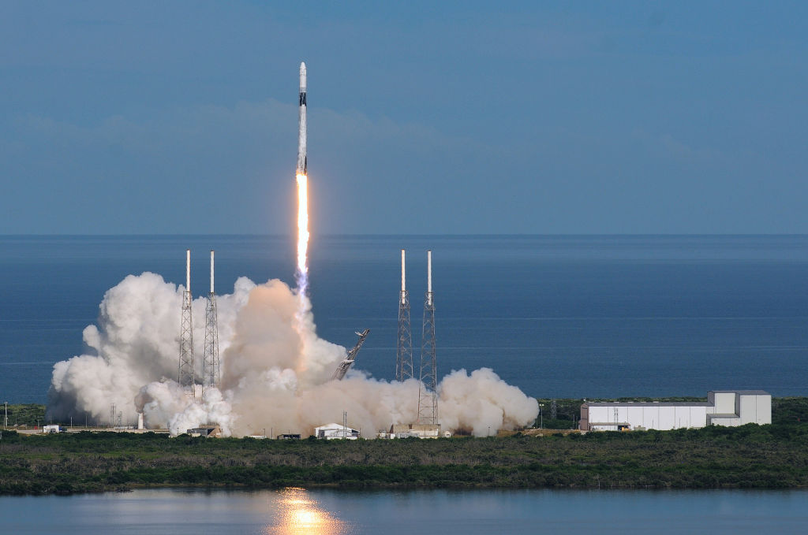

# `Day 99 - Advanced`

## `Objective` : Analyse and Visualise the Space Race

Use space mission data from 1957 onwards to analyse and visualise trends over time.
- To analyze and visualize the dataset from nextspaceflight.com regarding space missions, we'll follow a structured approach. 
- This involves cleaning the data, performing exploratory data analysis (EDA), and then creating various types of charts and visualizations to answer the questions posed. 
- Given the nature of this task, I'll outline a general approach and provide code snippets for key steps, focusing on Python libraries commonly used for data analysis and visualization, such as pandas for data manipulation, matplotlib and seaborn for plotting, and possibly geopandas if we delve into geographical data.
